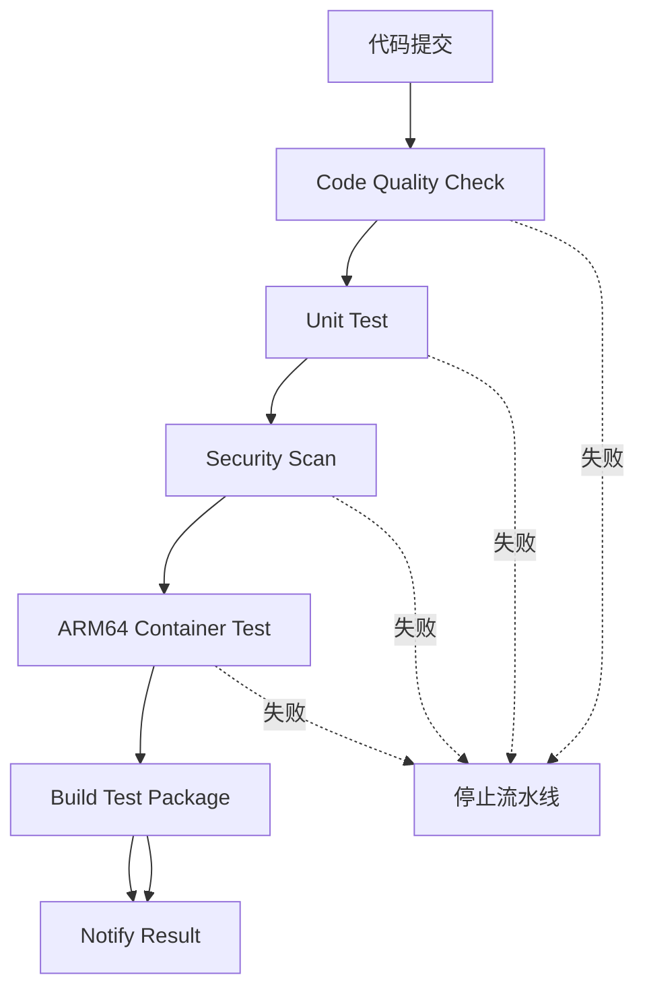

# CI/CD 配置说明

**版本**: v2.0  
**创建时间**: 2026-03-16  
**最后更新**: 2026-03-17 11:35  
**适用范围**: UFS Auto CI/CD 流水线

---

## 🎯 CI/CD 架构

### 流水线组成

```
UFS Auto CI
├── Code Quality Check（代码质量检查）
│   ├── Black 格式化检查
│   ├── isort 导入检查
│   └── flake8/pylint linting（非阻塞）
│
├── Unit Test（单元测试）
│   ├── 安装 FIO 工具
│   ├── 安装 Python 依赖
│   └── 运行 pytest 测试套件
│
├── Security Scan（安全扫描）
│   └── Bandit 安全扫描（忽略 B307/B306/B602）
│
├── ARM64 Container Test（ARM64 容器测试）
│   ├── 设置 QEMU ARM 模拟
│   ├── 在 Debian 12 ARM64 容器中运行测试
│   └── 验证架构兼容性
│
└── Build Test Package（构建测试包）
    └── 打包 systest 目录
```

---

## 📋 各 Job 详细说明

### 1. Code Quality Check

**目的**：确保代码质量和格式一致性

**检查项**：
- ✅ Black 格式化（Python 3.11 兼容）
- ✅ isort 导入顺序
- ✅ flake8 linting（忽略 F401/F541/E501/F841/W293）
- ✅ pylint（非阻塞，disable=C0114,C0115,C0116,R0801,W0613）

**配置**：
```yaml
- name: Python code formatting check
  run: |
    black --check systest/ --target-version py310
    isort --check systest/

- name: Python linting
  continue-on-error: true
  run: |
    flake8 systest/ --max-line-length=120 --ignore=F401,F541,E501,F841,W293
    pylint systest/ --disable=C0114,C0115,C0116,R0801,W0613
```

---

### 2. Unit Test

**目的**：运行所有单元测试，验证功能正确性

**关键配置**：
- ✅ 安装 FIO 工具（用于存储性能测试）
- ✅ 安装 Python 依赖
- ✅ 运行 pytest 测试套件

**配置**：
```yaml
- name: Install FIO
  run: |
    sudo apt-get update
    sudo apt-get install -y fio
    fio --version

- name: Run unit tests
  run: |
    cd systest
    python -m pytest tests/ -v --tb=short
```

**测试覆盖**：
- Performance 测试（9 个）
- QoS 测试（2 个）
- Reliability 测试（1 个）
- Scenario 测试（2 个）

---

### 3. Security Scan

**目的**：安全漏洞扫描

**工具**：Bandit（Python 安全扫描工具）

**忽略规则**：
- B307: eval() 用于阈值计算（内部使用，安全）
- B306: mktemp() 用于临时文件（测试需要）
- B602: shell=True 用于内部命令（测试框架需要）

**配置**：
```yaml
- name: Run bandit security scan
  run: |
    bandit -r systest/ -s B307,B306,B602 -ll -ii
```

---

### 4. ARM64 Container Test（新增）

**目的**：在 ARM64 Debian 12 容器中运行测试，验证架构兼容性

**关键配置**：
- ✅ 使用 QEMU 模拟 ARM64 架构
- ✅ 使用官方多架构镜像 debian:12
- ✅ 指定 --platform linux/arm64

**配置**：
```yaml
- name: Set up QEMU
  uses: docker/setup-qemu-action@v3
  with:
    platforms: arm64

- name: Run tests in ARM64 Debian 12 container
  uses: addnab/docker-run-action@v3
  with:
    image: debian:12
    options: --platform linux/arm64 -v ${{ github.workspace }}:/workspace
    run: |
      apt-get update
      apt-get install -y python3 python3-pip fio
      cd /workspace/systest
      pip3 install --break-system-packages -r requirements.txt
      python3 -m pytest tests/ -v --tb=short
```

**验证内容**：
- ✅ 架构验证（uname -m 应返回 aarch64）
- ✅ 系统验证（Debian 12）
- ✅ FIO 工具安装
- ✅ Python 依赖安装
- ✅ 完整测试套件运行

---

### 5. Build Test Package

**目的**：打包测试框架，用于分发和部署

**打包内容**：
- systest/ 目录
- docs/ 目录
- README.md
- requirements.txt

**配置**：
```yaml
- name: Build test package
  run: |
    mkdir -p build/ufs_test_package
    cp -r systest/ build/ufs_test_package/
    cp -r docs/ build/ufs_test_package/
    cp README.md build/ufs_test_package/
    cp requirements.txt build/ufs_test_package/
    tar zcf build/ufs_test_package.tar.gz -C build/ ufs_test_package

- name: Upload test package
  uses: actions/upload-artifact@v4
  with:
    name: ufs_test_package
    path: build/ufs_test_package.tar.gz
```

---

## 📊 CI/CD 流程



---

## 🔧 触发条件

### 自动触发
- ✅ push 到 master 分支
- ✅ push 到 develop 分支
- ✅ Pull Request 到 master/develop

### 手动触发
- ✅ GitHub Actions 页面手动运行

---

## 📈 预计运行时间

| Job | 预计时间 |
|-----|----------|
| Code Quality Check | 1-2 分钟 |
| Unit Test | 2-3 分钟 |
| Security Scan | 1-2 分钟 |
| ARM64 Container Test | 3-5 分钟 |
| Build Test Package | 1 分钟 |
| **总计** | **8-13 分钟** |

---

## 🎯 成功标准

**所有 Job 必须通过**：
- ✅ Code Quality Check: success
- ✅ Unit Test: success
- ✅ Security Scan: success
- ✅ ARM64 Container Test: success
- ✅ Build Test Package: success

---

## 📚 相关文档

- `TEST_CASE_COMMENT_STANDARD.md` - 测试用例注释规范
- `TEST_CASE_FRAMEWORK_GUIDE.md` - 测试案例框架指导原则
- `PRECONDITION_CORRECT_GUIDE.md` - Precondition 正确写法指南

---

**版本历史**:
- v2.0 (2026-03-17): 添加 ARM64 容器测试说明
- v1.0 (2026-03-16): 初始版本

---

**严格遵守此 CI/CD 配置，确保代码质量、功能正确性、架构兼容性！** ✅
