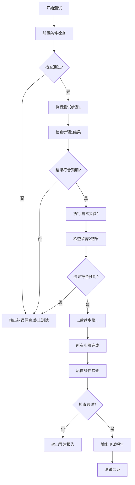

# 系统验证测试原则

## 🎯 核心测试原则
### 1. 前置条件检查（Precondition）优先
**所有测试执行前必须完成前置检查，确保环境符合预期：**
- 硬件环境检查：CPU型号、内存大小、UFS设备识别状态、温度传感器状态
- 软件环境检查：内核版本、驱动版本、挂载状态、可用空间、系统负载
- UFS设备配置检查：
  - Write Booster功能开关状态
  - 电源管理策略配置
  - 命令队列深度设置
  - 错误处理和ECC功能状态
  - Trim/Unmap功能是否开启
- **所有前置条件必须100%符合要求才能开始测试，不符合则立即终止并报错**

### 2. 测试过程可追溯，每步必验
**测试执行过程必须清晰、可追溯，每一步都要有检查：**
- 每一步操作都要有明确的操作内容、预期结果、实际结果记录
- 执行每一步后都要核验执行结果，符合预期才能进入下一步
- 任何步骤不符合预期立即终止测试，输出详细错误信息
- 所有操作和结果都要有日志记录，方便后续分析
- **禁止跳过检查步骤，禁止假设操作成功**

### 3. 失效信息最大化暴露
**任何失效都要完整暴露，方便问题定位：**
- 发生错误时记录完整的上下文信息：系统状态、UFS状态、操作步骤、错误日志
- 自动收集相关诊断信息：dmesg日志、内核日志、UFS健康状态
- 错误信息要包含时间戳、操作内容、预期结果、实际结果、错误码
- 所有错误日志要结构化存储，方便后续分析统计
- **禁止忽略任何错误，禁止静默失败**

### 4. 后置条件检查（Postcondition）
**测试结束后必须执行后置检查，评估对设备的影响：**
- UFS健康状态检查：温度、寿命百分比、剩余可用空间
- 错误统计：ECC错误计数、读写错误计数、超时错误计数
- 磨损统计：擦除次数分布、坏块数量
- 性能基线对比：测试前后的性能变化
- 文件系统完整性检查：测试目录下的文件完整性校验
- **所有后置检查结果必须和测试前的基线做对比，异常情况立即上报**

### 5. 系统盘测试安全原则
**由于UFS是系统盘，严格禁止危险操作：**
✅ 允许的操作：
- 在`/mapdata/ufs_test/`目录下进行文件级读写测试
- 读取UFS状态信息和健康信息
- 执行fio性能测试（指定测试文件在测试目录下）
- 执行stress-ng压力测试（文件IO压力）
- 读取系统日志和设备信息

❌ 禁止的操作：
- 禁止格式化、分区、挂载/卸载系统盘
- 禁止直接写入原始块设备`/dev/sda`
- 禁止修改系统分区表和系统文件
- 禁止执行会导致系统崩溃或数据丢失的操作
- 禁止修改UFS固件和底层配置
- **任何可能影响系统稳定的操作必须提前评估，获得批准后才能执行**

### 6. 严谨性原则
**所有测试工作必须严谨，禁止假设和猜测：**
- 不清晰的需求必须确认，禁止自行假设
- 所有测试方法和标准必须有明确的出处（协议标准、行业规范、客户需求）
- 所有测试结果必须有证据支持（日志、截图、数据）
- 遇到不确定的问题及时上报，共同确认
- 资源和信息不足时及时提出，不要隐瞒问题
- **鼓励多问问题，不鼓励盲目执行**

---
## 📋 标准测试流程
### 通用测试执行步骤

### 测试报告标准内容
1. 测试基本信息：测试时间、测试人员、测试环境、设备信息
2. 前置条件检查结果：所有检查项的状态和数据
3. 测试执行过程：每一步的操作、预期结果、实际结果
4. 后置条件检查结果：和测试前基线的对比数据
5. 测试结论：是否通过、存在的问题、风险点
6. 附件：日志文件、错误截图、性能数据

---
## 🔧 测试框架实现要求
### 公共库必须实现的功能
1. **环境检查模块**：自动化完成所有前置/后置条件检查
2. **日志模块**：结构化记录所有操作和结果，包含时间戳和上下文
3. **错误处理模块**：统一错误上报，自动收集诊断信息
4. **结果校验模块**：统一的结果校验和断言功能
5. **报告生成模块**：自动生成标准化测试报告

### 测试用例编写规范
1. 每个测试用例必须包含明确的前置条件、测试步骤、预期结果、后置条件
2. 每一步操作后必须有对应的检查点
3. 所有参数必须可配置，避免硬编码
4. 用例必须支持独立运行，不依赖其他用例
5. 用例必须有明确的通过/失败标准

---
## 🤝 沟通原则
1. 需求不清晰立即询问，不做任何假设
2. 遇到问题第一时间上报，不隐瞒、不拖延
3. 技术方案必须经过评审才能实施
4. 风险点提前预警，并有应对方案
5. 所有决策和变更都要有记录，可追溯

现在请大家按照以上原则开展工作，有任何不明确的地方随时沟通。
