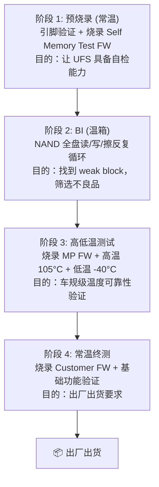
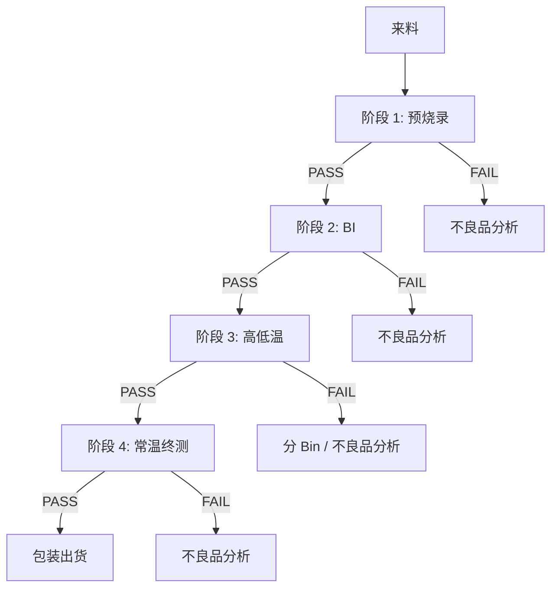
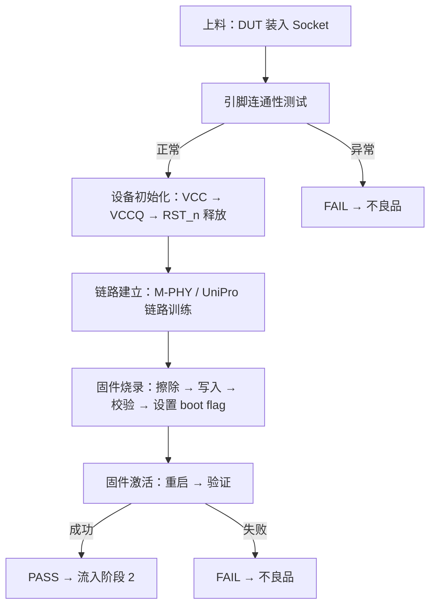
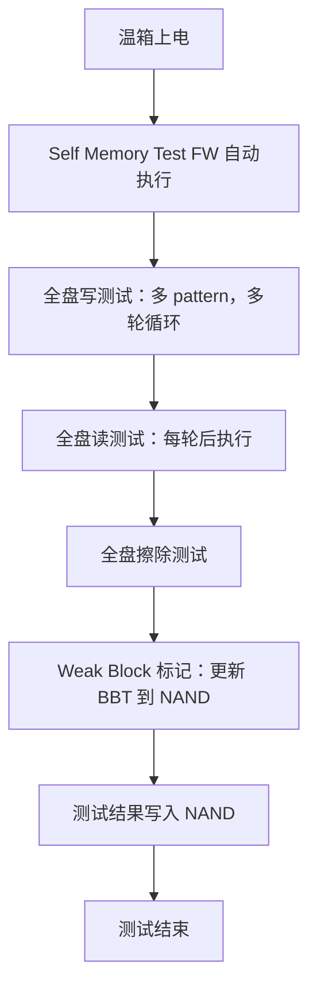
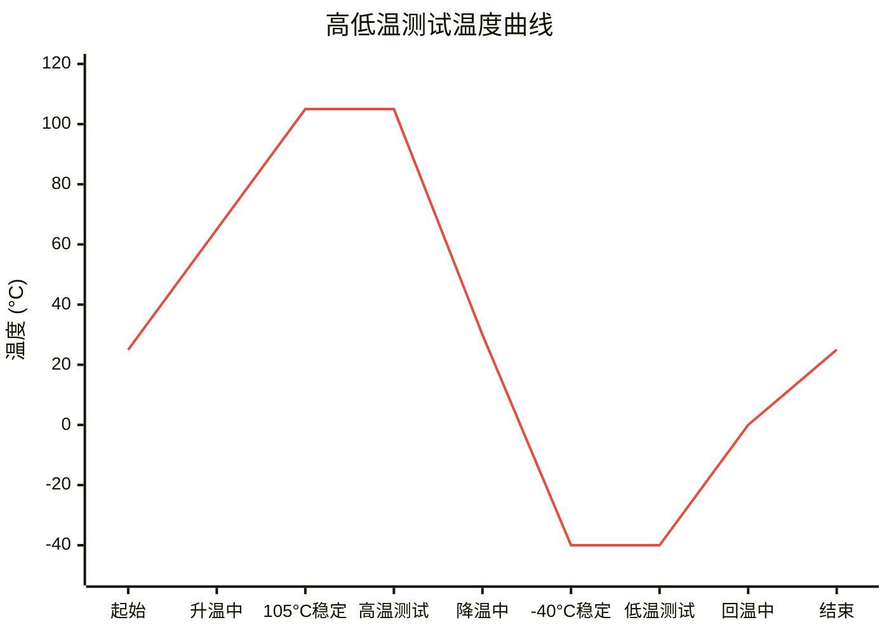
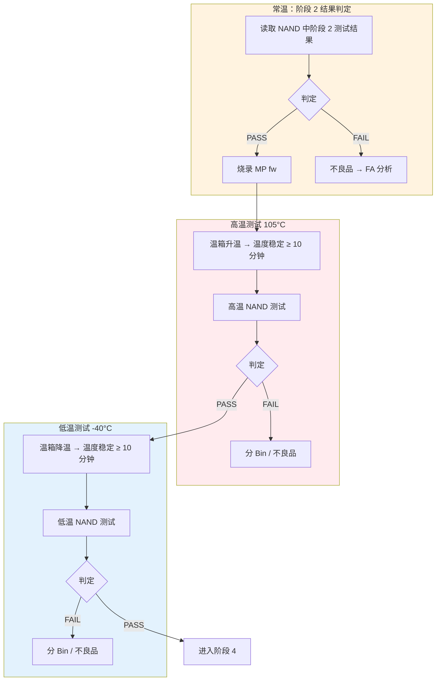
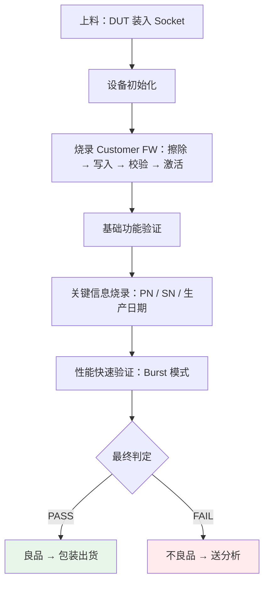

# UFS 3.1 生产测试 FT 规范

---

## 1. 测试流程概述

### 1.1 四阶段测试流程

### 1.2 测试流程图

---

## 2. 阶段 1：预烧录测试规范

### 2.1 测试目的

- 验证 DUT 引脚连通性
- 烧录 Self Memory Test Firmware

### 2.2 测试内容

#### 2.2.1 引脚连通性测试

| 测试项 | 测试方法 | 判定标准 |
|--------|---------|---------|
| 开路检测 | 对每个引脚施加测试电压，测量电流 | 电流 < 1μA |
| 短路检测 | 测量相邻引脚间电阻 | 电阻 > 1MΩ |
| 电源引脚检查 | 测量 VCC/VCCQ 对地电阻 | 电阻在规格范围内 |
| 接地检查 | 测量 GND 引脚连通性 | 电阻 < 50mΩ |

#### 2.2.2 固件烧录

| 测试项 | 测试方法 | 判定标准 |
|--------|---------|---------|
| Firmware 擦除 | 擦除 Firmware 分区 | 擦除成功 |
| Firmware 写入 | 写入 Self Memory Test FW | 写入成功 |
| Firmware 校验 | 读回校验（CRC 或 checksum） | CRC 校验通过 |
| Boot Flag 设置 | 设置 boot flag | 设置成功 |
| Firmware 激活 | 重启设备，验证 FW 运行 | 设备就绪 |

### 2.3 测试流程

### 2.4 判定标准

| 结果 | 处理 |
|------|------|
| 所有测试项 PASS | 流入阶段 2 |
| 任一测试项 FAIL | 不良品，送分析 |

---

## 3. 阶段 2：BI

### 3.1 测试目的

- 筛选 weak block 和早期失效的 NAND
- 更新坏块表（BBT）

### 3.2 测试条件

| 参数 | 要求 |
|------|------|
| 测试温度 | 高温 85°C ± 5°C（加速筛选） |
| 并行数 | 待定 |
| 测试模式 | 使用阶段 1 烧录的 Self Memory Test FW 自动执行 |
| 测试容量 | 128GB 全盘 |

### 3.3 测试内容

#### 3.3.1 全盘写测试

| 测试项 | Pattern | 循环次数 | 说明 |
|--------|---------|---------|------|
| 全盘写 1 | 0x00 | 1 轮 | 测试 cell 能编程到最"0"的状态 |
| 全盘写 2 | 0xFF | 1 轮 | 测试 cell 保持最"1"的状态 |
| 全盘写 3 | Random | 3 轮 | 模拟真实数据分布 |
| 全盘写 4 | 0x55/0xAA | 1 轮 | Checkerboard pattern，测试相邻 cell 干扰 |

#### 3.3.2 全盘读测试

| 测试项 | 测试方法 | 判定标准 |
|--------|---------|---------|
| 数据一致性 | 读取与写入 pattern 比较 | Bit error 数 < ECC 纠错能力 |
| 读时间 | 记录读取时间 | 时间在规格范围内 |

#### 3.3.3 全盘擦除测试

| 测试项 | 测试方法 | 判定标准 |
|--------|---------|---------|
| 擦除验证 | 擦除后读回应为 0xFF | 数据一致 |
| 擦除时间 | 记录擦除时间 | 时间在规格范围内 |

### 3.4 测试流程

---

## 4. 阶段 3：高低温测试规范

### 4.1 测试目的

- 读取阶段 2 全盘读写测试结果并判定
- 车规级温度可靠性验证
- 确保在极端温度下功能正常

### 4.2 测试条件

| 参数 | 要求 |
|------|------|
| 常温测试温度 | 23°C ± 5°C（阶段 2 结果判定） |
| 高温测试温度 | 105°C ± 5°C |
| 低温测试温度 | -40°C ± 5°C |
| 温度稳定时间 | 10-15 分钟 |
| 并行数 | 根据测试机台规格 |

### 4.3 阶段 2 结果读取与判定（常温）

首先读取 NAND 中阶段 2 全盘读写测试的结果，判定通过后进入高低温测试。

#### 4.3.1 阶段 2 结果读取

| 步骤 | 说明 |
|------|------|
| 读取测试结果 | 从 NAND 中读取阶段 2 全盘读写测试结果 |
| 解析结果数据 | 解析 Bit Error Count、Bad Block Count、读写时间等 |
| 执行判定 | 按下表标准判定 |

#### 4.3.2 阶段 2 结果判定标准

| 指标 | Pass | Warning | Fail |
|------|------|---------|------|
| Bit Error Count（每 1KB） | < 40 bit | 40-60 bit | > 60 bit |
| Bad Block Count（128GB 全盘） | < 80 blocks | 80-120 blocks | > 120 blocks |
| 写入时间（单 Page） | < 2 ms | 2-3 ms | > 3 ms |
| 擦除时间（单 Block） | < 10 ms | 10-15 ms | > 15 ms |

#### 4.3.3 判定结果处理

| 结果 | 处理 |
|------|------|
| 所有指标 Pass | 继续进入高低温测试 |
| 有 Warning 项但无 Fail | 继续测试，标记 Warning |
| 任一指标 Fail | 不良品，不进入高低温测试，送 FA 分析 |

### 4.4 MP Firmware 烧录

| 测试项 | 测试方法 | 判定标准 |
|--------|---------|---------|
| Firmware 擦除 | 擦除阶段 1 的 Self Memory Test FW | 擦除成功 |
| Firmware 写入 | 写入 MP FW | 写入成功 |
| Firmware 校验 | 读回校验（CRC） | CRC 校验通过 |
| Firmware 激活 | 重启设备，验证 FW 运行 | 设备就绪 |

### 4.5 温度循环规范

#### 4.5.1 温度曲线

> 红色区域 (>85°C)：高温测试区间
> 蓝色区域 (<0°C)：低温测试区间

#### 4.5.2 温度转换要求

| 参数 | 要求 |
|------|------|
| 升温速率 | 5-10°C/min |
| 降温速率 | 5-10°C/min |
| 温度稳定判定 | DUT 温度与设定温度偏差 < ±5°C，保持 ≥ 5 分钟 |
| 高温保持时间 | ≥ 10 分钟（含温度稳定时间） |
| 低温保持时间 | ≥ 10 分钟（含温度稳定时间） |
| 温度监测点 | DUT 表面或 Socket 附近 |

### 4.6 测试内容

测试层面：通过 MP fw 实现

#### 4.6.1 高温测试 (105°C)

| 测试项 | 测试方法 | 判定标准 |
|--------|---------|---------|
| 高温 NAND 读写 | 写入 pattern → 读回比较 | 数据一致，Bit error < ECC 阈值 |
| 高温 Page Read Time | 测量 NAND page 读取时间 | < 规格上限（典型 < 100 μs） |
| 高温 Page Program Time | 测量 NAND page 编程时间 | < 规格上限（典型 < 2.5 ms） |
| 高温 Block Erase Time | 测量 NAND block 擦除时间 | < 规格上限（典型 < 15 ms） |
| 高温电流 | 测量 Active IDD | VCC < 500mA, VCCQ < 250mA |
| 高温启动 | 上电 → 检查 Controller 就绪 | 正常启动 |
| 高温 ECC 检查 | 统计高温读写的 bit error 数 | < ECC 能力的 55% |

#### 4.6.2 低温测试 (-40°C)

| 测试项 | 测试方法 | 判定标准 |
|--------|---------|---------|
| 低温启动 | 上电后检查 Controller 就绪 | 正常启动 |
| 低温 NAND 读写 | 写入 pattern → 读回比较 | 数据一致，Bit error < ECC 阈值 |
| 低温 Page Read Time | 测量 NAND page 读取时间 | < 规格上限（典型 < 120 μs） |
| 低温 Page Program Time | 测量 NAND page 编程时间 | < 规格上限（典型 < 3 ms） |
| 低温 Block Erase Time | 测量 NAND block 擦除时间 | < 规格上限（典型 < 18 ms） |
| 低温电流 | 测量 Active IDD | VCC < 500mA, VCCQ < 250mA |
| 低温 ECC 检查 | 统计低温读写的 bit error 数 | < ECC 能力的 55% |

注：
- 低温下 NAND 操作时间通常比常温增加 20-50%（NAND 特性）
- 高温下 NAND bit error 通常比常温增加（电荷泄漏加速）

### 4.7 测试流程

### 4.8 判定标准

| 结果 | 处理 |
|------|------|
| 阶段 2 结果 + 高温 + 低温全部 PASS | 流入阶段 4 |
| 性能不达标但功能正常 | 分 Bin（降级处理） |
| 功能异常（数据不一致/启动失败） | FAIL，送 FA 分析 |

---

## 5. 阶段 4：常温终测规范

### 5.1 测试目的

- 烧录 Customer Firmware
- 写入 Part Number、SN 等关键信息

### 5.2 测试条件

| 参数 | 要求 |
|------|------|
| 测试温度 | 23°C ± 5°C |
| 测试模式 | 单颗或并行测试 |

### 5.3 测试内容

#### 5.3.1 Customer Firmware 烧录

| 测试项 | 测试方法 | 判定标准 |
|--------|---------|---------|
| Firmware 擦除 | 擦除阶段 3 的 MP FW | 擦除成功 |
| Firmware 写入 | 写入 Customer FW（UFS 协议固件） | 写入成功 |
| Firmware 校验 | 读回校验（CRC） | CRC 校验通过 |
| Firmware 激活 | 重启设备，验证 FW 运行 | 设备就绪 |

#### 5.3.2 基础功能验证

| 测试项 | 测试方法 | 判定标准 |
|--------|---------|---------|
| Device ID 验证 | 读取 Device Descriptor | 匹配客户规格 |
| 基本读写 | 写入 pattern → 读回 | 数据一致 |
| LU 配置验证 | 读取 Unit Descriptor | LU 数量/大小正确 |
| RPMB 验证 | 写入/读取 RPMB 分区 | 认证通过，数据一致 |
| Write Booster 验证 | 启用 WB → 写入测试（如支持） | WB 加速效果正常 |
| 电源管理验证 | 进入 Sleep/Hibernate → 测量电流 | 电流在规格内 |
| 健康状态验证 | 读取 Health Descriptor | 无异常标记 |

#### 5.3.3 关键信息烧录

| 信息项 | 说明 | 验证方法 |
|--------|------|---------|
| Part Number | 产品型号（UFS 3.1 128GB） | 读回校验 |
| Serial Number | 唯一序列号 | 读回校验 |
| 生产日期/批次号 | 生产追溯 | 读回校验 |
| 测试通过标记 | 设置"测试通过"flag | 读回校验 |

#### 5.3.4 性能快速验证

默认快速验证（Burst 模式）：

| 测试项 | 测试条件 | 判定标准（Burst 下限） | 测试时长 |
|--------|---------|---------------------|---------|
| 顺序读 | 128K block | ≥ 2,100 MB/s | ~60 秒 |
| 顺序写 | 128K block | ≥ 1,650 MB/s | ~60 秒 |
| 随机读 | 4K QD32 | ≥ 200 KIOPS | ~60 秒 |
| 随机写 | 4K QD32 | ≥ 330 KIOPS | ~60 秒 |

### 5.4 测试流程

### 5.5 判定标准

| 结果 | 处理 |
|------|------|
| 所有测试项 PASS | 良品，包装出货 |
| 任一测试项 FAIL | 不良品，送分析 |
