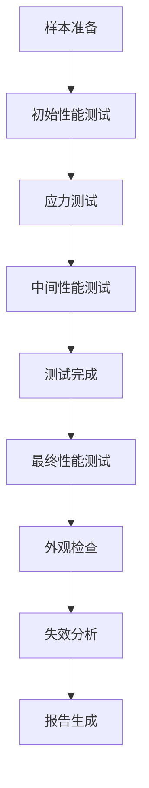

# 群联PS8363+长存SQS 128GB UFS 3.1车规级可靠性测试策略与方案
**版本：** V1.0  
**发布日期：** 2026-03-11  
**产品等级：** AEC-Q100 Grade 2  
**适用温度范围：** -40℃ ~ +105℃  
**参考标准：**
- AEC-Q100 Revision H (2021) - 车载电子元件应力测试认证标准
- JEDEC JESD22 系列 - 半导体器件可靠性测试方法
- IEC 60068 系列 - 环境测试标准
- GB/T 28046 系列 - 道路车辆 电气及电子设备的环境条件和试验
- ISO 16750 系列 - 道路车辆 电子电气设备的环境条件和试验
- 群联PS8363车规级可靠性设计规范
- 长江存储SQS NAND车规级可靠性要求
---
## 1. 测试范围与目标
### 1.1 测试对象
- 量产版本：群联PS8363主控 + 长江存储SQS 128GB 3D TLC NAND
- 封装形式：BGA-153 11.5x13mm 车规级封装
- 样本批次：3个连续生产批次，每批次32片
### 1.2 测试目标
1. 验证产品完全符合AEC-Q100 Grade 2所有测试要求
2. 验证产品在车规级严苛环境下的可靠性与寿命
3. 提供量化的可靠性指标，支持ISO 26262功能安全认证
4. 识别潜在失效模式，制定相应的预防与纠正措施
### 1.3 测试覆盖项
| 测试类别       | 测试项数量 | 样本量要求 | 测试周期 |
|----------------|------------|------------|----------|
| 环境可靠性测试 | 12项       | 每类15-77片 | 1000小时 |
| 机械可靠性测试 | 8项        | 每类15-30片 | 200小时  |
| 电气可靠性测试 | 10项       | 每类15-45片 | 500小时  |
| 长期可靠性测试 | 6项        | 每类30-77片 | 2000小时 |
| **总计**       | **36项**   | **累计528片次** | **3700小时** |
---
## 2. 通用测试条件与判定标准
### 2.1 标准测试条件
| 参数           | 标准值                     | 公差范围 |
|----------------|----------------------------|----------|
| 环境温度       | 25℃ ± 2℃                   | ±2℃      |
| 相对湿度       | 45% ~ 75% RH               | ±10%     |
| 供电电压       | 3.3V ± 0.1V                | ±0.1V    |
| 参考时钟       | 19.2MHz ± 100ppm           | ±100ppm  |
| 测试板         | 标准车规UFS测试载板        | -        |
### 2.2 通用判定标准
#### 2.2.1 功能性判定（所有测试后必须满足）
1. UFS设备可正常识别，无砖化、无永久损坏
2. 全容量顺序读写无错误，数据校验和100%正确
3. 4K随机读写IOPS下降≤20%（与初始值对比）
4. 无不可纠正ECC错误（UECC）
5. 设备健康状态报告正常，无致命错误
#### 2.2.2 外观判定（所有测试后必须满足）
1. 封装无开裂、无变形、无鼓包
2. 引脚无氧化、无脱落、无弯曲
3. 标记清晰、无剥落
4. 焊接性能符合J-STD-002要求
#### 2.2.3 失效率判定
- 所有测试项目允许失效数：0（零失效判定）
- 若出现失效，需执行失效分析（FA），根因明确并采取纠正措施后，重新进行测试
---
## 3. 环境可靠性测试方案（AEC-Q100 Group A）
### 3.1 加速环境应力测试
| 测试项ID | 测试名称               | 测试条件                                                                 | 样本量 | 测试周期 | 失效判据                                                                 | 参考标准               |
|----------|------------------------|--------------------------------------------------------------------------|--------|----------|--------------------------------------------------------------------------|------------------------|
| ENV-001 | 高温工作寿命（HTOL）   | - 温度：105℃（Grade 2最高工作温度） - 偏置：3.3V工作电压 - 负载：100%持续IO读写 - 时间：1000小时 | 77片   | 1000小时 | 1. 测试过程中无设备掉盘、无IO错误 2. 测试后功能、性能符合通用判定标准 3. 数据保持能力≥10年（推算） | AEC-Q100 4.1, JESD22-A108 |
| ENV-002 | 低温工作寿命（LTOL）   | - 温度：-40℃（Grade 2最低工作温度） - 偏置：3.3V工作电压 - 负载：100%持续IO读写 - 时间：1000小时 | 77片   | 1000小时 | 1. 测试过程中无设备掉盘、无IO错误 2. 测试后功能、性能符合通用判定标准 | AEC-Q100 4.1, JESD22-A108 |
| ENV-003 | 温度循环（TC）         | - 温度范围：-55℃ ~ +125℃ - 转换时间：<10s - 停留时间：15min - 循环次数：1000次 | 77片   | 250小时  | 1. 无封装开裂、无引脚脱落 2. 测试后功能正常 3. 无内部接触不良 | AEC-Q100 4.2, JESD22-A104 |
| ENV-004 | 功率温度循环（PTC）    | - 结温范围：-40℃ ~ +105℃ - 升降温速率：10℃/min - 停留时间：15min - 循环次数：1000次 - 工作负载：动态切换 | 45片   | 200小时  | 1. 无封装分层、无芯片裂纹 2. 测试后功能正常 3. 性能下降≤10% | AEC-Q100 4.3, JESD22-A105 |
| ENV-005 | 高温高湿工作（HTHH）   | - 温度：85℃ - 湿度：85% RH - 偏置：3.3V工作电压 - 负载：50%IO读写 - 时间：1000小时 | 45片   | 1000小时 | 1. 无腐蚀、无氧化 2. 测试后功能正常 3. 无数据丢失 | AEC-Q100 4.4, JESD22-A101 |
| ENV-006 | 高温高湿存储（THB）    | - 温度：85℃ - 湿度：85% RH - 偏置：无（存储状态） - 时间：1000小时 | 45片   | 1000小时 | 1. 无腐蚀、无氧化 2. 上电后功能正常 3. 数据保持完整 | AEC-Q100 4.4, JESD22-A101 |
| ENV-007 | 低温存储（LTS）        | - 温度：-65℃ - 时间：1000小时 - 偏置：无 | 15片   | 1000小时 | 1. 无封装开裂、无材料脆化 2. 上电后功能正常 | AEC-Q100 4.5, JESD22-A119 |
| ENV-008 | 高温存储（HTS）        | - 温度：150℃ - 时间：1000小时 - 偏置：无 | 15片   | 1000小时 | 1. 无封装变形、无焊点熔化 2. 上电后功能正常 3. 数据保持完整 | AEC-Q100 4.5, JESD22-A103 |
| ENV-009 | 温度冲击（TS）         | - 温度范围：-65℃ ~ +150℃ - 转换时间：<10s - 停留时间：15min - 循环次数：100次 | 15片   | 50小时   | 1. 无封装开裂、无分层 2. 无引脚断裂、无脱焊 3. 功能正常 | AEC-Q100 4.6, JESD22-A106 |
| ENV-010 | 快速温度变化（QTC）    | - 温度范围：-40℃ ~ +105℃ - 升降温速率：30℃/min - 循环次数：500次 | 15片   | 100小时  | 1. 无热应力导致的失效 2. 功能正常 | AEC-Q100 4.7, IEC 60068-2-14 |
| ENV-011 | 盐雾测试（Salt Spray） | - 盐溶液浓度：5% NaCl - 温度：35℃ - 喷雾时间：96小时 - 干燥时间：48小时 | 15片   | 144小时  | 1. 引脚腐蚀面积≤5% 2. 功能正常 3. 焊接性能符合要求 | AEC-Q100 4.8, IEC 60068-2-11 |
| ENV-012 | 气体腐蚀测试           | - 混合气体：H2S、Cl2、NO2、SO2 - 浓度：ppb级 - 温度：40℃ - 湿度：75% RH - 时间：168小时 | 15片   | 168小时  | 1. 无明显腐蚀 2. 功能正常 3. 接触电阻变化≤10% | AEC-Q100 4.9, IEC 60068-2-60 |
---
## 4. 机械可靠性测试方案（AEC-Q100 Group D）
### 4.1 机械应力测试
| 测试项ID | 测试名称               | 测试条件                                                                 | 样本量 | 测试周期 | 失效判据                                                                 | 参考标准               |
|----------|------------------------|--------------------------------------------------------------------------|--------|----------|--------------------------------------------------------------------------|------------------------|
| MECH-001 | 振动测试（Vibration）  | - 频率范围：10Hz ~ 2000Hz - 加速度：20G - 扫频速率：1oct/min - 轴向：X/Y/Z三个轴向 - 时间：每轴向2小时 | 30片   | 6小时    | 1. 测试过程中无掉盘、无IO错误 2. 无内部元件松动、无焊点脱落 3. 功能正常 | AEC-Q100 4.16, JESD22-B103 |
| MECH-002 | 机械冲击测试（Shock）  | - 加速度：1500G - 脉冲宽度：0.5ms - 波形：半正弦波 - 轴向：X/Y/Z正负六个方向 - 次数：每方向10次 | 30片   | 1小时    | 1. 无封装开裂、无芯片损坏 2. 无引脚断裂、无焊点脱落 3. 功能正常 | AEC-Q100 4.17, JESD22-B104 |
| MECH-003 | 掉落测试（Drop）       | - 高度：1.5m - 跌落表面：混凝土 - 轴向：六个方向 - 次数：每方向3次 | 15片   | 2小时    | 1. 无封装损坏、无BGA球脱落 2. 功能正常 3. 数据完整 | AEC-Q100 4.18, JESD22-B111 |
| MECH-004 | 引脚强度测试（Lead Integrity） | - 拉力：每引脚1N - 时间：10s - 引脚数量：所有引脚 | 15片   | 4小时    | 1. 无引脚脱落、无断裂 2. 封装本体无损坏 | AEC-Q100 4.19, JESD22-B105 |
| MECH-005 | 可焊性测试（Solderability） | - 焊锡温度：260℃ - 浸润时间：5s - 方法：浸焊 | 15片   | 2小时    | 1. 引脚浸润面积≥95% 2. 无冷焊、虚焊 | AEC-Q100 4.20, JESD22-B102 |
| MECH-006 | 焊接耐热测试（Solder Heat） | - 温度：260℃ - 时间：10s - 次数：3次 | 15片   | 1小时    | 1. 无封装损坏、无内部分层 2. 功能正常 | AEC-Q100 4.21, JESD22-B106 |
| MECH-007 | 板级弯曲测试（Board Bend） | - 弯曲应变：1000 microstrain - 保持时间：30s - 次数：3次 | 15片   | 2小时    | 1. 无BGA焊点裂纹、无脱落 2. 功能正常 | AEC-Q100 4.22, IPC-9701 |
| MECH-008 | 刮擦测试（Scratch）    | - 压力：10N - 刮擦速度：10mm/s - 表面：封装表面、引脚 | 15片   | 2小时    | 1. 标记清晰可辨 2. 引脚镀层无穿透 3. 功能正常 | AEC-Q100 4.23, IEC 60068-2-70 |
---
## 5. 电气可靠性测试方案（AEC-Q100 Group E）
### 5.1 电气应力测试
| 测试项ID | 测试名称               | 测试条件                                                                 | 样本量 | 测试周期 | 失效判据                                                                 | 参考标准               |
|----------|------------------------|--------------------------------------------------------------------------|--------|----------|--------------------------------------------------------------------------|------------------------|
| ELEC-001 | 过电压测试（Overvoltage） | - 电压：3.6V（额定电压+10%） - 时间：24小时 - 负载：100%IO | 15片   | 24小时   | 1. 无器件损坏、无烧毁 2. 测试后功能正常 | AEC-Q100 4.24, JESD22-C101 |
| ELEC-002 | 欠电压测试（Undervoltage） | - 电压：2.7V（额定电压-18%） - 时间：24小时 - 负载：100%IO | 15片   | 24小时   | 1. 无功能异常、无掉盘 2. 测试后功能正常 | AEC-Q100 4.24, JESD22-C101 |
| ELEC-003 | 浪涌电压测试（Surge）  | - 电压：±40V - 脉冲宽度：1ms - 次数：1000次 - 极性：正负 | 15片   | 2小时    | 1. 无器件损坏、无过流烧毁 2. 功能正常 | AEC-Q100 4.25, ISO 7637-2 |
| ELEC-004 | ESD静电放电测试        | - 人体模型（HBM）：±8kV - 器件模型（CDM）：±1kV - 接触放电：±6kV - 空气放电：±15kV | 30片   | 4小时    | 1. 无器件损坏、无Latch-up 2. 功能正常 3. 数据完整 | AEC-Q100 4.26, JESD22-C101 |
| ELEC-005 | 闩锁测试（Latch-up）   | - 电流：1.5倍最大工作电流 - 温度：125℃ - 时间：1s | 15片   | 4小时    | 1. 无闩锁发生 2. 测试后功能正常 | AEC-Q100 4.27, JESD78 |
| ELEC-006 | 电源纹波测试           | - 纹波频率：100kHz ~ 1MHz - 纹波幅度：±200mV - 负载：动态变化 | 15片   | 24小时   | 1. 无IO错误、无掉盘 2. 功能正常 | AEC-Q100 4.28, ISO 16750-2 |
| ELEC-007 | 电磁兼容性测试（EMC）  | - 辐射发射（RE）：CISPR 25 Class 3 - 辐射抗扰（RI）：ISO 11452-2 - 传导发射（CE）：CISPR 25 Class 3 - 传导抗扰（CI）：ISO 11452-4 | 15片   | 72小时   | 1. 发射符合限值要求 2. 抗扰测试中功能正常，无数据损坏 | AEC-Q100 4.29, CISPR 25 |
| ELEC-008 | 功耗测试               | - 待机模式：≤10mW - 活跃模式：≤500mW - 睡眠模式：≤1mW - 温度范围：-40℃ ~ +105℃ | 15片   | 24小时   | 1. 各模式功耗符合规格要求 2. 无异常高功耗情况 | AEC-Q100 4.30, JESD22-C103 |
| ELEC-009 | 上电时序测试           | - 上电斜率：0.1V/ms ~ 10V/ms - 掉电斜率：0.1V/ms ~ 10V/ms - 重复次数：1000次 | 15片   | 10小时   | 1. 无上电失败、无砖化 2. 功能正常 | AEC-Q100 4.31, JESD22-C104 |
| ELEC-010 | IO端口耐压测试         | - 电压：-0.5V ~ 3.6V - 时间：1小时 - 所有IO端口 | 15片   | 15小时   | 1. 无端口损坏 2. 功能正常 | AEC-Q100 4.32, JESD22-C105 |
---
## 6. 长期可靠性测试方案
### 6.1 寿命与耐久性测试
| 测试项ID | 测试名称               | 测试条件                                                                 | 样本量 | 测试周期 | 失效判据                                                                 | 参考标准               |
|----------|------------------------|--------------------------------------------------------------------------|--------|----------|--------------------------------------------------------------------------|------------------------|
| LIFE-001 | P/E循环寿命测试        | - 温度：25℃、55℃、85℃三个温度点 - 模式：全盘随机写入 - 循环次数：3000次（TLC标称寿命） | 30片   | 1000小时 | 1. 无坏块增长超过阈值 2. ECC错误率≤1e-15 3. 性能下降≤20% 4. 数据保持能力符合要求 | JEDEC JESD218A, JESD219 |
| LIFE-002 | 数据保持能力测试       | - 温度：85℃ - 时间：1000小时 - 预条件：3000次P/E循环后写入数据 | 30片   | 1000小时 | 1. 数据读取无错误 2. 不可纠正错误率=0 3. 推算常温下数据保持≥10年 | JEDEC JESD22-A117 |
| LIFE-003 | 读干扰测试             | - 温度：55℃ - 读次数：每块10^7次 - 验证间隔：每10^6次验证一次 | 15片   | 500小时  | 1. 无读干扰导致的位错误 2. ECC可纠正所有错误 3. 无数据损坏 | JEDEC JESD22-A123 |
| LIFE-004 | 写干扰测试             | - 温度：55℃ - 写模式：相邻块反复写入 - 循环次数：10^5次 | 15片   | 300小时  | 1. 未写入块无位错误 2. 数据完整 | JEDEC JESD22-A124 |
| LIFE-005 | 擦除干扰测试           | - 温度：55℃ - 擦除模式：相邻块反复擦除 - 循环次数：10^5次 | 15片   | 300小时  | 1. 未擦除块无位错误 2. 数据完整 | JEDEC JESD22-A125 |
| LIFE-006 | 长期老化测试           | - 温度：60℃ - 负载：70%读写混合 - 时间：2000小时 - 模拟真实车载使用场景 | 77片   | 2000小时 | 1. 失效率≤1 FIT（10^9小时失效1次） 2. MTBF≥200万小时 3. 无致命失效 | IEC 61709, GB/T 3187 |
---
## 7. 特殊车规场景可靠性测试
### 7.1 车载场景专项测试
| 测试项ID | 测试名称               | 测试条件                                                                 | 样本量 | 测试周期 | 失效判据                                                                 |
|----------|------------------------|--------------------------------------------------------------------------|--------|----------|--------------------------------------------------------------------------|
| SCEN-001 | 车辆启动测试           | - 温度：-40℃、-20℃、0℃、25℃、85℃、105℃ - 启动次数：10000次 - 模拟车辆冷启动、热启动 | 30片   | 100小时  | 1. 启动成功率100% 2. 识别时间≤2s 3. 无启动失败、无砖化 |
| SCEN-002 | 电压波动模拟测试       | - 模拟车辆启动电压跌落：3.3V→6V→3.3V - 模拟负载突增：电压跌落10% - 模拟发电机故障：电压波动±20% - 重复次数：10000次 | 30片   | 50小时   | 1. 无掉盘、无数据损坏 2. 功能正常 |
| SCEN-003 | 驾驶数据耐久性测试     | - 模拟每秒写入10MB驾驶数据 - 连续写入3年等效数据量 - 温度循环：-40℃~85℃ | 15片   | 500小时  | 1. 无数据丢失 2. 写入延迟≤10ms 3. 寿命满足10年使用要求 |
| SCEN-004 | 异常掉电耐久性测试     | - 随机在IO过程中断电 - 温度范围：-40℃~105℃ - 掉电次数：10000次 | 15片   | 100小时  | 1. 无砖化、无永久损坏 2. 元数据完整 3. 最多丢失正在写入的数据 |
---
## 8. 测试流程与质量控制
### 8.1 测试执行流程

### 8.2 质量控制措施
1. **样本控制：** 所有样本来自连续3个生产批次，每批次样本量≥32片，包含边缘工艺样本
2. **设备校准：** 所有测试设备每年校准一次，测试前进行点检，确保测试条件准确
3. **过程监控：** 测试过程中实时监控温度、电压、IO状态，异常情况自动记录并告警
4. **数据管理：** 所有测试数据自动存储，不可篡改，保存期限≥15年
5. **失效分析：** 所有失效样本进行FA分析，包括SAT、SEM、EDX、TEM等手段，明确根因
### 8.3 测试报告要求
测试报告必须包含以下内容：
- 测试条件、样本信息、测试设备
- 详细的测试数据、性能变化曲线
- 失效分析报告、根因分析与纠正措施
- 可靠性指标推算结果（MTBF、失效率、寿命等）
- 符合AEC-Q100 Grade 2的声明
---
## 9. 可靠性指标与认证支持
### 9.1 量化可靠性指标
| 指标名称               | 要求值                     | 备注                     |
|------------------------|----------------------------|--------------------------|
| 工作温度范围           | -40℃ ~ +105℃               | AEC-Q100 Grade 2         |
| 存储温度范围           | -65℃ ~ +150℃               |                          |
| MTBF（平均无故障时间） | ≥2,000,000小时             | 常温工作条件下           |
| 失效率                 | ≤1 FIT                     | 1 FIT = 1失效/10^9小时   |
| P/E循环寿命            | ≥3000次                    | 全盘写入                 |
| 数据保持时间           | ≥10年                      | 常温25℃存储              |
| 耐振动能力             | 20G, 10-2000Hz             |                          |
| 耐冲击能力             | 1500G, 0.5ms               |                          |
### 9.2 认证支持
本测试方案完全满足以下认证要求：
1. AEC-Q100 Grade 2 车规认证
2. ISO 26262 ASIL B 功能安全认证
3. IATF 16949 质量管理体系认证
4. GB/T 38114 车载电子信息系统标准
---
## 10. 数据来源与修订记录
### 10.1 数据来源
- AEC-Q100 Revision H (2021) - Automotive Electronics Council
- JEDEC JESD22 Series - Solid State Technology Association
- IEC 60068 Series - International Electrotechnical Commission
- ISO 16750 Series - International Organization for Standardization
- 群联PS8363车规级可靠性手册 v1.1 (2025)
- 长江存储SQS NAND车规级可靠性规范 v2.0 (2025)
- 地平线J6平台存储可靠性要求 v3.0 (2025)
### 10.2 修订记录
| 版本 | 日期       | 修订内容               | 修订人 |
|------|------------|------------------------|--------|
| V1.0 | 2026-03-11 | 初始版本，完成全部可靠性测试方案设计 | 车规可靠性测试团队 |
